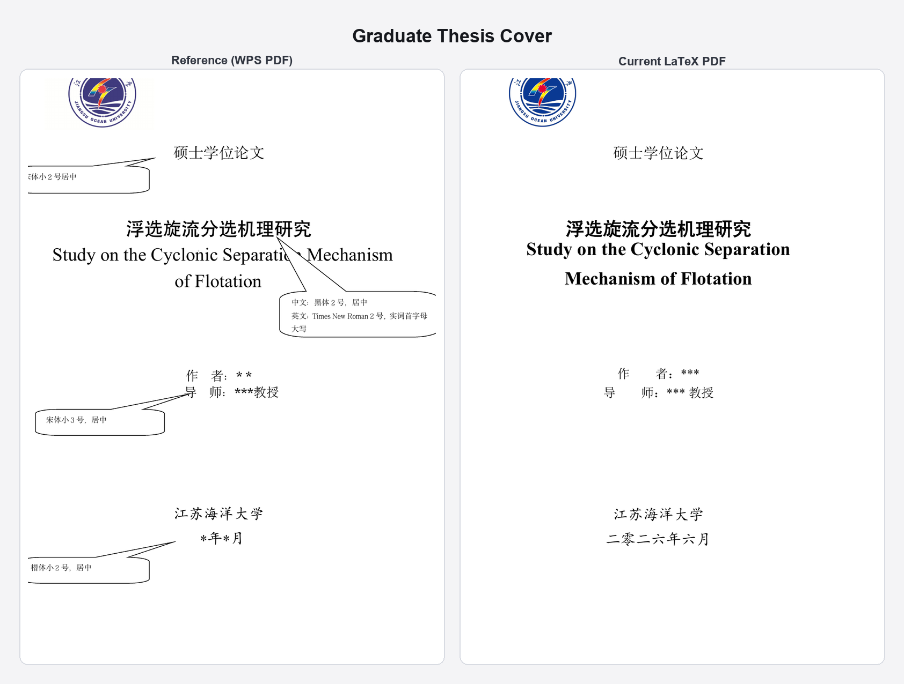
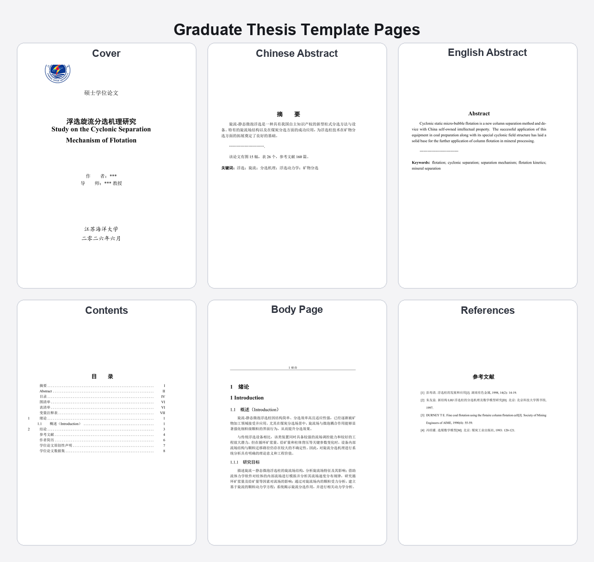
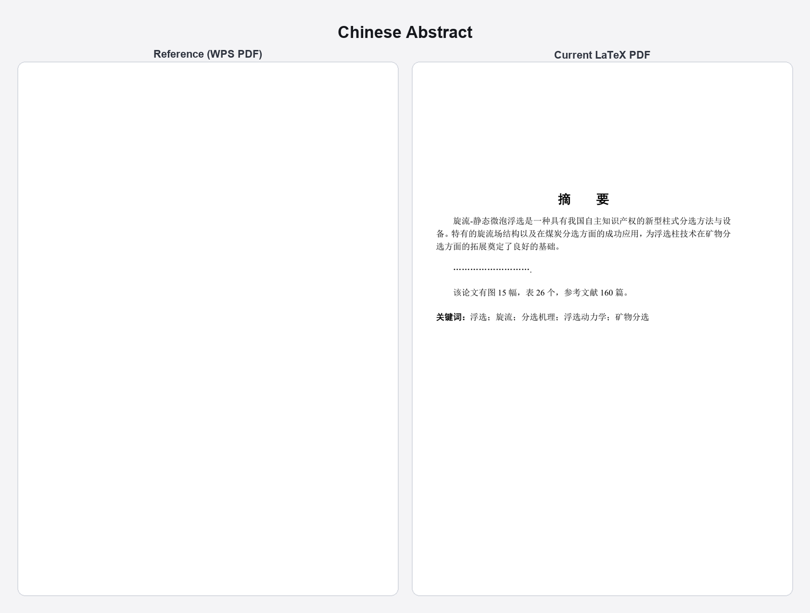
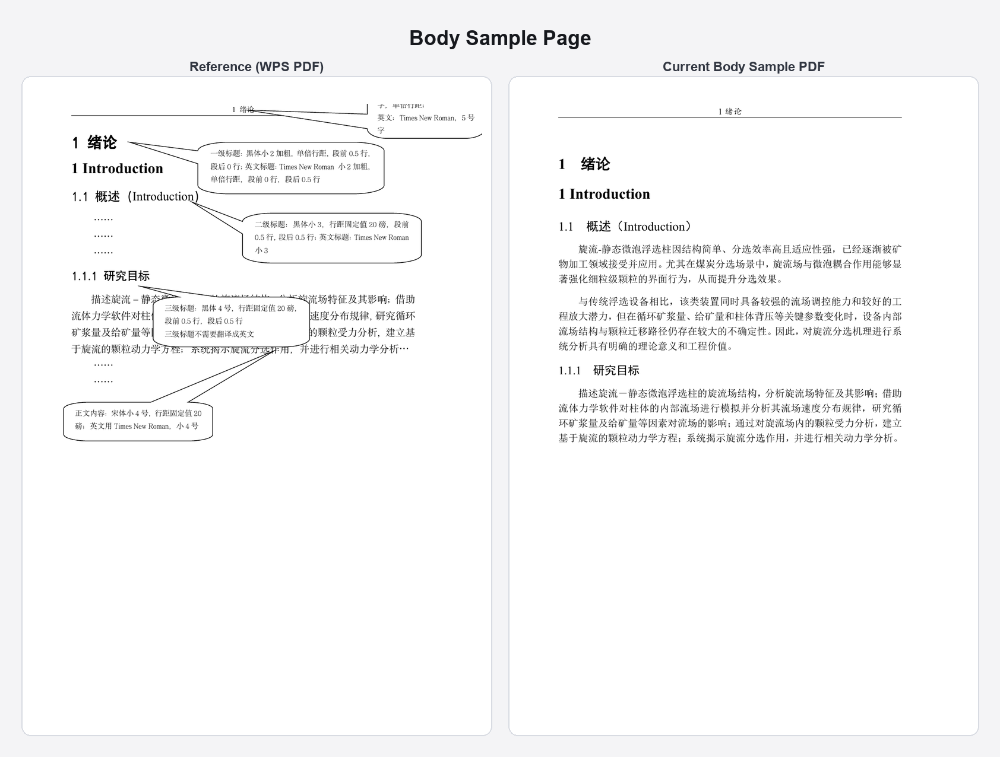

# 江苏海洋大学研究生毕业论文 LaTeX 模板

本项目的目标不是“复刻一篇样张论文”，而是提供一个可以正常写作、符合学术规范、并尽量贴近学校参考件的研究生毕业论文模板。

模板设计思路参考了主流高校模板的共同做法，例如 [ThuThesis](https://github.com/tuna/thuthesis)、[SJTUThesis](https://github.com/sjtug/SJTUThesis)、[ustcthesis](https://github.com/ustctug/ustcthesis) 和 [fduthesis](https://github.com/stone-zeng/fduthesis)：

- 用户只改内容入口，不改版式代码
- 特殊页锁版，正文和目录链路保持正常 LaTeX 写作方式
- 图表、目录、参考文献、交叉引用自动生成
- 编译入口尽量简单，默认使用 `latexmk + XeLaTeX`
- 保留像素级回归测试，避免模板迭代时版式退步

## 发布渠道

- `GitHub 仓库`：完整版本，包含字体策略、对齐测试、打包脚本和 README 预览资产，以此为准。
- `Overleaf 上传包`：通过 `make package` 生成，适合预览和分享，但本地正式编译仍是首选。
- `本科生模板`：如果你需要江苏海洋大学本科毕业论文模板，请前往 [JOU-Undergraduate-Thesis-LaTeX-Template](https://github.com/TsekaLuk/JOU-Undergraduate-Thesis-LaTeX-Template)。

## 核心特性

- `学术规范优先`：优先使用宋体、黑体、楷体、Times New Roman 及其合法本地字体。
- `特殊页锁版`：封面、授权声明、内封、审阅认定书、原创性声明、数据集等页面保留锁版策略。
- `正文正常写作`：摘要、目录、图表清单、变量表、正文、参考文献保持正常 LaTeX 链路。
- `开箱可编译`：仓库自带开源兜底字体，没有本地商业字体也能预览。
- `一键导入正式字体`：`make import-fonts` 会从系统、WPS 和桌面常见目录自动复制字体到 `fonts/proprietary/`。
- `可视化对齐资产`：支持封面对比图、README 预览图和正文样页基线。
- `回归测试`：通过 `pytest` 保持和研究生参考 Word/PDF 的结构与关键锚点对齐。

## 预览

### 研究生论文封面：参考样页 vs 当前模板



### 研究生模板画廊

下图展示当前模板的核心页面：封面、中文摘要、英文摘要、目录、正文样页、参考文献。



### 关键版式细节：摘要与正文对比





## 模板范围

当前仓库只覆盖研究生毕业论文主模板，不包含本科仓库中的配套表单、专项摘要模板或其他工作手册模板。

模板入口文件包括：

- 论文主模板：`main.tex`
- 正文样页基线：`samples/body-sample.tex`
- 集中配置入口：`contents/setup.tex`
- 用户内容层：`contents/user/*.tex`
- 正文章节入口：`contents/user/chapters/*.tex`

## 仓库结构

如果你第一次打开这个仓库，只要认这 4 个入口：

```text
contents/
├── setup.tex                    # 题名、作者、导师、页面开关、盲审模式
├── user/
│   ├── frontmatter-content.tex  # 致谢、摘要、关键词、变量表
│   ├── chapters/*.tex           # 正文章节
│   └── backmatter-content.tex   # 结论后面的可编辑内容
└── chapters/mainmatter.tex      # 正文聚合入口（通常由脚手架命令自动维护）
```

其他 `styles/*.cls`、`styles/*.sty` 和锁版页通常不需要改。

## 首次使用 60 秒

如果你不想先研究模板内部结构，直接按这个顺序做：

```bash
make quickstart
```

然后只改这 3 层：

1. [contents/setup.tex](/Users/tseka_luk/Documents/江苏海洋大学个人事物工作/JOU-Graduate-Thesis-LaTeX-Template/contents/setup.tex)
2. [contents/user/frontmatter-content.tex](/Users/tseka_luk/Documents/江苏海洋大学个人事物工作/JOU-Graduate-Thesis-LaTeX-Template/contents/user/frontmatter-content.tex)
3. [contents/user/chapters](/Users/tseka_luk/Documents/江苏海洋大学个人事物工作/JOU-Graduate-Thesis-LaTeX-Template/contents/user/chapters)

`make quickstart` 会执行：

```bash
make import-fonts
make doctor
make
```

如果你已经熟悉环境，也可以跳过 `quickstart`，直接用单独命令。

## 3 分钟上手

1. 修改 `contents/setup.tex` 中的题名、作者、导师、学位信息。
2. 修改 `contents/user/frontmatter-content.tex` 中的致谢、摘要、关键词、变量表。
3. 在 `contents/user/chapters/` 下按章节写正文，默认示例是 `01-introduction.tex`。
4. 修改 `contents/user/backmatter-content.tex` 中的附录、作者简历、原创性声明正文和数据集说明。
5. 运行 `make` 或 `latexmk -xelatex main.tex` 编译论文。

如果你只想先看模板效果，直接编译 `main.tex` 即可。  
如果你本机已有常用学术字体，可先运行 `make import-fonts` 自动导入到 `fonts/proprietary/`。

## 写作者工作流

这套模板现在更像成熟高校模板的使用方式：

- `setup.tex` 只管论文元数据和模式开关
- `contents/user/chapters/*.tex` 只管正文写作
- 目录、图表清单、参考文献自动生成
- 特殊页继续锁版，但内容字段从统一入口读入

如果你不想研究模板内部实现，只需要记住一条：

> 平时写论文，只改 `setup + frontmatter-content + chapters + backmatter-content`。

## 常见任务速查

| 你要做什么 | 最快入口 |
|-----------|----------|
| 第一次跑通模板 | `make quickstart` |
| 检查字体和环境 | `make doctor` |
| 新增一章 | `make new-chapter NAME=08-literature-review TITLE_CN=文献综述 TITLE_EN="Literature Review"` |
| 正式编译论文 | `make` |
| 粗略统计正文字符数 | `make wordcount` |
| 生成对齐和 README 预览图 | `make cover-diff` / `make readme-images` |
| 跑回归测试 | `make test` |

## 推荐编辑边界

日常写论文时，优先编辑这些文件：

- `contents/setup.tex`
- `contents/user/frontmatter-content.tex`
- `contents/user/chapters/*.tex`
- `contents/user/backmatter-content.tex`

通常不要直接修改这些文件，除非你在调整模板样式：

- `styles/jougraduate.cls`
- `styles/jougraduateheadings.sty`
- `contents/frontmatter/*.tex`
- `contents/backmatter/*.tex`

## 写作骨架

- `contents/user/chapters/01-introduction.tex`：默认启用的第一章示例。
- `contents/user/chapters/02-07*.tex`：更接近真实研究生论文的 starter 骨架。
- `contents/user/chapters/_template.tex`：新增章节时直接复制这个文件。
- `contents/user/chapters/README.md`：说明章节命名和接入方式。
- `contents/chapters/mainmatter.tex`：维护正文章节输入顺序。

如果你需要新增章节，推荐直接运行：

```bash
make new-chapter NAME=08-literature-review TITLE_CN=文献综述 TITLE_EN="Literature Review"
```

如果你只是想预览，不实际写文件：

```bash
python3 scripts/new_chapter.py --name 08-literature-review --title-cn 文献综述 --title-en "Literature Review" --dry-run
```

## 本地编译（推荐）

本地编译可以使用完整字体链路，适合正式提交与高保真预览。

### 环境要求

- TeX Live 2020+ 或 MikTeX 2.9+
- `xelatex`
- Python 3.9+
- Poppler（运行对齐测试和生成预览图时需要）

### 下载仓库字体

```bash
make fonts
```

### 一键导入本机正式字体

```bash
make import-fonts
```

脚本会优先扫描：

- Windows `C:/Windows/Fonts`
- macOS `/System/Library/Fonts`、`/Library/Fonts`、`~/Library/Fonts`
- WPS 安装目录
- 桌面常见字体目录，例如 `~/Desktop/毕业论文字体`

如果字体不在默认目录，可以直接运行：

```bash
python3 scripts/import_fonts.py --search-dir /path/to/fonts
```

先预览复制计划：

```bash
python3 scripts/import_fonts.py --dry-run
```

### 编译论文

```bash
make
```

Windows 用户也可以直接双击仓库根目录下的 `build.bat`。

或手动执行：

```bash
python3 scripts/download_fonts.py
latexmk main.tex
```

### 首次使用推荐命令

```bash
make quickstart
```

如果你只想先诊断本机状态，不立刻编译：

```bash
make doctor
```

## 跨系统一致性指南

如果你希望 Windows、macOS、Linux 之间尽量保持同一套版式结果，推荐固定按这 3 步执行：

```bash
make import-fonts
make env-check
make
```

推荐理解方式：

1. `make import-fonts`
   - 先把本机已有的正式字体导入 `fonts/proprietary/`
   - 这样不同系统更容易命中同一套宋体、黑体、楷体、Times New Roman
2. `make env-check`
   - 再检查 `xelatex`、`bibtex`、Poppler、关键 TeX 包和仓库关键文件是否齐全
   - 先把“环境缺东西”排掉，再看版式问题
3. `make`
   - 最后正式编译论文
   - 如果三台机器都走这套顺序，跨系统结果会稳定很多

需要明确的一点是：模板保证的是“跨系统可编译、可交付”，不是“任何机器天然像素完全一致”。

字体不一致时，常见差异包括：

- 英文题名或长标题的换行位置不同
- 中英文混排段落的行宽和段落节奏略有变化
- 封面、内封、摘要这类版心敏感页面出现轻微上移或下移
- 目录、图表清单、参考文献页的分页位置可能变化
- 图题、表题和正文中的单行/双行判断可能不同

简单说：

- 命中同一套正式字体：跨系统结果通常会很接近
- 一台机器走正式字体、一台机器走开源兜底字体：通常仍能正常编译，但版式可能有轻微差异
- 最终提交前：建议在目标机器上重新跑一遍 `make import-fonts -> make env-check -> make`

### 常用验证命令

```bash
make env-check
make new-chapter NAME=08-literature-review TITLE_CN=文献综述 TITLE_EN="Literature Review"
make wordcount
make test
make cover-diff
make readme-images
```

## AI 工具辅助写作

本模板的 `.tex` 源文件结构清晰，适合配合 AI 编辑工具使用：

| 工具 | 使用方式 |
|------|----------|
| Cursor / Trae | 在 AI 原生编辑器中打开仓库，直接对话修改 `.tex` 文件 |
| Claude Code | 命令行 AI，适合批量修改内容、调整排版 |
| Codex / OpenClaw / Antigravity | 其他 AI 编程工具，均可直接编辑 `.tex` 源文件 |

推荐做法：用 AI 工具辅助填写内容与调整结构，用 `make` 或 `latexmk` 在本地编译预览。

## Overleaf（辅助预览，有限制）

Overleaf 可用于快速预览，但存在以下限制，**不建议用于最终提交版本**：

- 需要使用 `make package` 生成的上传包
- 无法保证命中和本地完全一致的正式字体链路
- 免费版编译时间有限
- 复杂图表和本地字体导入体验不如本地仓库

## 页面开关

`contents/setup.tex` 已提供几个常用布尔开关，默认都为 `true`：

- `blind-review`
- `include-acknowledgements`
- `include-appendix`
- `include-author-resume`
- `include-originality`
- `include-dataset`

其中：

- `blind-review = true` 会启用匿名评审模式，自动隐藏作者、导师、学号、培养单位等识别信息，并关闭致谢、作者简历、原创性声明页面。
- 其他 `include-*` 开关用于控制普通模式下是否输出对应页面。
- 新增章节优先使用 `make new-chapter`，不要手工维护 `mainmatter.tex`，除非你明确知道自己在改什么。

如果学院或导师要求暂时不输出某一部分，直接改布尔值即可，不需要手动删 `main.tex` 里的页面输入。

## 字体策略

模板自动按以下优先级加载字体：

1. `fonts/proprietary/` 中的本地正式字体
2. 系统已有的标准学术字体
3. WPS 兼容字体
4. `fonts/opensource/` 中的开源兜底字体

检查当前字体状态：

```bash
python3 scripts/check_fonts.py
```

更多说明见 [fonts/README.md](fonts/README.md)。

## 与本科生模板的关系

本仓库是同级本科模板工程标准的研究生版本，继续复用：

- 字体检测与加载系统
- 开源兜底字体
- 跨平台字体兼容测试
- 参考文档 XML 拆解与 PDF 对齐基线
- 一键导入本机字体和预览资产生成思路

本科生模板直达：[江苏海洋大学本科生毕业论文模板](https://github.com/TsekaLuk/JOU-Undergraduate-Thesis-LaTeX-Template)

## QA

### 为什么仓库不直接附带商业字体，以及怎么一键导入。

商业字体大多属于系统字体、Office 字体或商业字库，公共仓库不适合直接再分发。

模板已经提供了两层方案：

- 本地正式字体：把你合法拥有的字体放进 `fonts/proprietary/`
- 一键导入：直接运行 `make import-fonts`，脚本会从 Windows 字体目录、macOS 字体目录、WPS 安装目录和桌面字体目录自动复制并规范命名

如果机器上没有这些正式字体，模板仍然会回退到仓库内置的开源字体，保证能编译、能预览、能继续写论文。

### 第一次打开仓库，最短路径是什么？

推荐顺序只有三步：

1. `make quickstart`
2. 改 `contents/setup.tex`
3. 开始写 `contents/user/chapters/*.tex`

如果 `make quickstart` 中途失败，先单独运行 `make doctor` 看字体或环境缺什么。

### 我只想写论文，不想碰样式代码怎么办？

只改这四处即可：

- `contents/setup.tex`
- `contents/user/frontmatter-content.tex`
- `contents/user/chapters/*.tex`
- `contents/user/backmatter-content.tex`

样式文件和锁版页默认不需要修改。

## 开源许可

项目代码采用 [LaTeX Project Public License v1.3c](https://www.latex-project.org/lppl.txt)。
仓库内的开源兜底字体随各自许可证分发；用户本地放入 `fonts/proprietary/` 的专有字体不随仓库再分发，仍受原字体许可约束。
